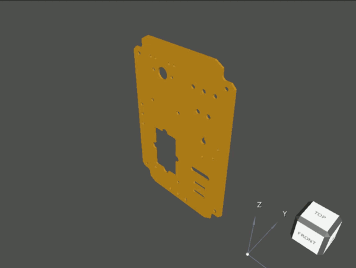

# STEP File Viewer

> :warning: **Work in Progress**: This project is currently under development.

## Description

This is a STEP file viewer that enables you to view 3D models in the STEP file
format directly in your web browser. The project utilizes the Open CASCADE
Technology (OCCT) library for handling STEP files and is compiled with
Emscripten to WebAssembly, allowing for high-performance rendering in the
browser.

## Features

- View 3D STEP files in your web browser
- Pan, zoom, and rotate 3D models
- High-performance rendering


<br>
<sub>Note: The GIF is of reduced quality for file size considerations.</sub>


## Building

#### For Linux
To build the project, simply run the following command:

```bash
make
```

Once the build is successful, you can run the demo with the following command:

```bash
make demo
```

This will start the demo, and you should be able to view it in your web browser.


## License

This project is licensed under the terms of the GNU Lesser General Public
License (LGPL) as published by the Free Software Foundation; either version 2.1
of the License, or (at your option) any later version. See the
[LICENSE.txt](LICENSE.txt) file for the full text of the LGPL.

### OCCT LGPL Exception

This project uses Open CASCADE Technology (OCCT) libraries and is also subject
to the OCCT LGPL Exception, which can be found in the file
[OCCT_LGPL_EXCEPTION.txt](OCCT_LGPL_EXCEPTION.txt).
